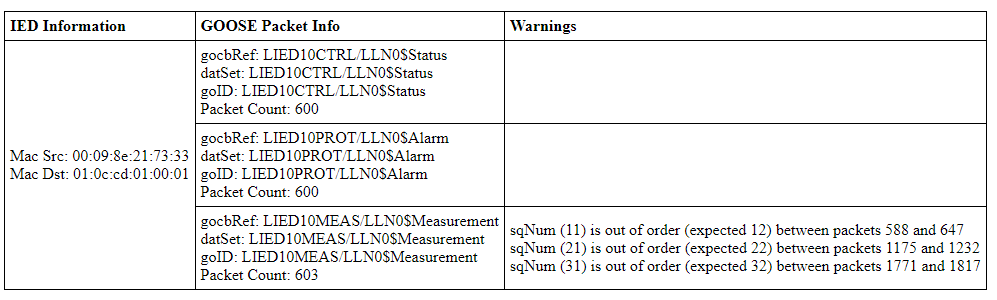

# GOOSE Packet Analyzer

Analyzes PCAP Files and detect GOOSE Anomalies

The PCAP files in the pcap folder are from this git repo https://github.com/smartgridadsc/IEC61850SecurityDataset/tree/master.
This includes the README.md in that folder as well.

## Function
This Script generates an HTML report for all GOOSE packets. 

The report sorts the packets per IED (per source and destination mac address) and then per GOOSE Metadata (gocbRef, datSet and goID have to be the same).
If it finds something suspicious it reports it under warning. It also counts the total Packets per different GOOSE Metadata, which can also give hints that 
there are problems especially if there are different counts per IED and GOOSE Metadata (this is seen in the example picture as there are 
3 packets more in Measurement compared to Alarm and Status).
